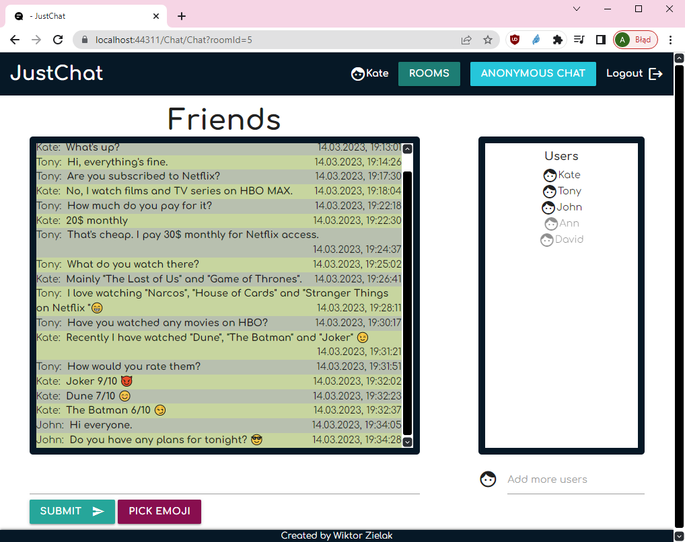

# JustChat

## Table of contents

- [Website URL](#website-url)
- [General info](#general-info)
- [Technologies](#technologies)
- [Screenshots](#screenshots)

## Website URL

https://justchat.arronax23.hostingasp.pl

## General info

Web chat application. Users can create Rooms and invite each other there. Anonymous chat option is pairing two users without showing their nicknames.

## Technologies

- ASP.NET Core 3.1 Razor Pages
- SignalR
- MS SQL
- Entity Framework Core
- ASP.NET Core Identity
- MaterializeCSS

## Screenshots

